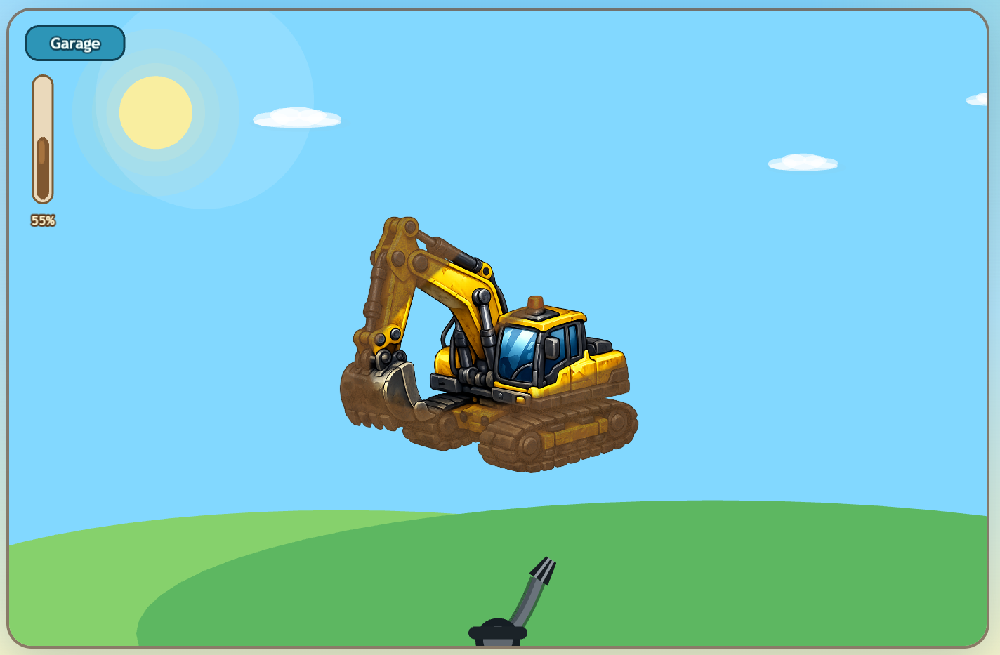

# Adrian's Carwash

Adrian's Carwash is a cheerful browser game where players pick a vehicle, spray away the dirt, and celebrate when the job is done. It was built as a playful, kid-friendly web experience and is dedicated to my son, Adrian.

[Play the live game](https://carwash.athemedia.se/)



## About The Project

This project blends a simple arcade-style interaction with bright visuals, playful audio, and touch-friendly controls. Players can choose from a lineup of heavy vehicles and wash them clean with a hose, revealing a celebration screen once the dirt is gone.

It is a small game, but it was made with care to feel polished, welcoming, and fun on both desktop and mobile devices.

## Features

- Vehicle selection screen with multiple construction and utility vehicles
- Click-and-drag or tap-and-spray washing gameplay
- Responsive layout designed for desktop and mobile play
- Animated scenes, sound effects, and completion celebration
- Web app metadata for a polished browser experience

## Built With

- React
- TypeScript
- Phaser
- Vite

## Getting Started

To run the project locally:

```bash
npm install
npm run dev
```

To create a production build:

```bash
npm run build
```

To preview the production build locally:

```bash
npm run preview
```

## Live Site

The game is available here:

<https://carwash.athemedia.se/>

## Dedication

This project is dedicated to my son, Adrian.
